# 🚀 Smart IT Service Desk (Automated ITIL Project)

## 📌 Project Overview

This project is a **Python-based Automated IT Service Desk system** developed to replace manual helpdesk processes such as calls, emails, and chats.

It automates:

* Ticket creation and management
* Incident handling
* SLA tracking and escalation
* System monitoring (CPU, RAM, Disk)
* Logging and reporting
* Problem detection for repeated issues

The system follows **ITIL (Information Technology Infrastructure Library)** best practices.

---

## 🎯 Core Features

### 🎫 Ticket Management Module

* Create Ticket
* View All Tickets
* Search Ticket by ID
* Update Ticket Status
* Close Ticket
* Delete Ticket

Each ticket includes:

* Ticket ID
* Employee Name
* Department
* Issue Description
* Priority
* Status
* Created Date

---

### 🧠 ITIL Implementation

#### ✔ Incident Management

Handles system failures (e.g., Server Down) with priority-based escalation.

#### ✔ Service Request Management

Automatically resolves requests like **Password Reset**.

#### ✔ Problem Management

If the same issue occurs **5 times**, a problem record is created in:

```
data/problems.json
```

#### ✔ Change Management

Logs change requests for updates and fixes.

#### ✔ SLA Monitoring

Tracks resolution time based on priority:

* P1 → 1 Hour
* P2 → 4 Hours
* P3 → 8 Hours
* P4 → 24 Hours

---

### ⚙️ System Monitoring Module

Monitors:

* CPU Usage
* Memory Usage
* Disk Usage

If thresholds exceed:

* CPU > 90%
* RAM > 95%
* Disk > 90%

👉 Automatically:

* Creates a **P1 ticket**
* Logs critical alerts

---

### 📊 Reporting Module

#### Daily Report

* Total Tickets
* Open Tickets
* Closed Tickets
* High Priority Tickets

#### Monthly Report

* Most common issue
* Department-wise analysis

---

### 📁 File Handling

* JSON storage (`tickets.json`, `problems.json`)
* CSV backup (`backup.csv`)
* Log tracking (`logs.txt`)

---

### 🧪 Testing

Implemented using **pytest**

Covers:

* Ticket creation
* Priority logic
* SLA breach
* Monitoring auto ticket creation
* File read/write
* Search ticket
* Exception handling

✔ All test cases passing successfully

---

## 🧠 Technologies Used

* Python (Core + Advanced)
* OOP Concepts (Inheritance, Encapsulation, Polymorphism)
* File Handling (JSON, CSV)
* Logging
* Regular Expressions (Regex)
* pytest (Testing)
* psutil (System Monitoring)

---

## ▶️ How to Run

### 1. Install Dependencies

```bash
pip install -r requirements.txt
```

### 2. Run Application

```bash
python main.py
```

### 3. Run Test Cases

```bash
python -m pytest test_app.py
```

---

## 📂 Project Structure

```
smart_it_service_desk/
│── main.py
│── tickets.py
│── monitor.py
│── reports.py
│── itil.py
│── utils.py
│── logger.py
│── test_app.py
│── requirements.txt
│── README.md
│── data/
│   ├── tickets.json
│   ├── logs.txt
│   ├── backup.csv
│   └── problems.json
│── screenshots/
```

---

## 📸 Screenshots

## 📸 Screenshots

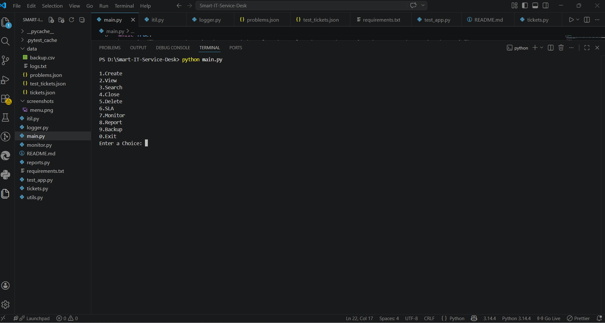
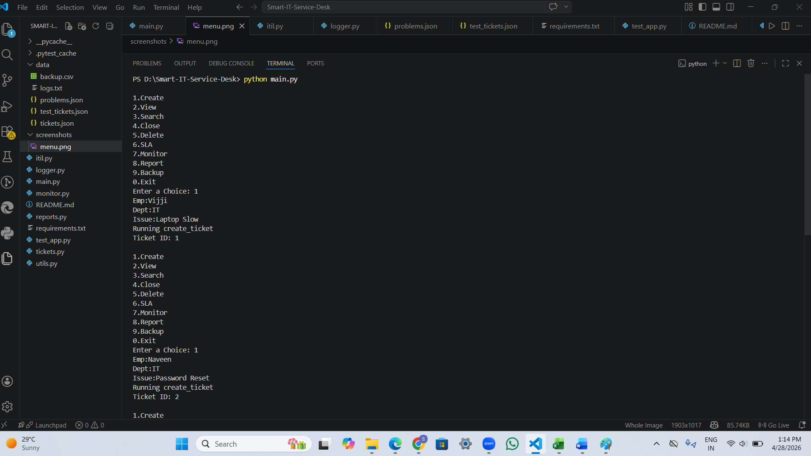
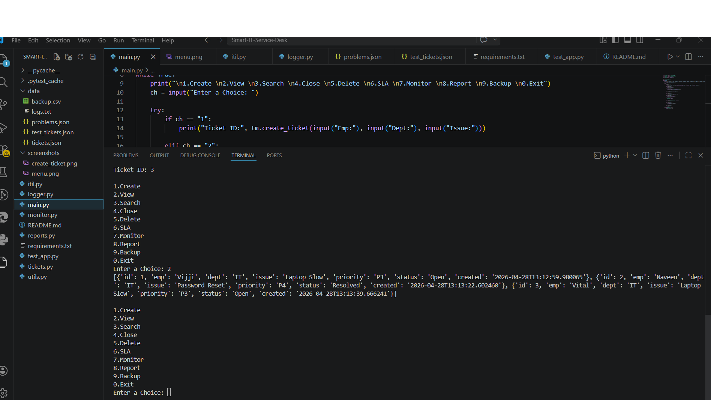
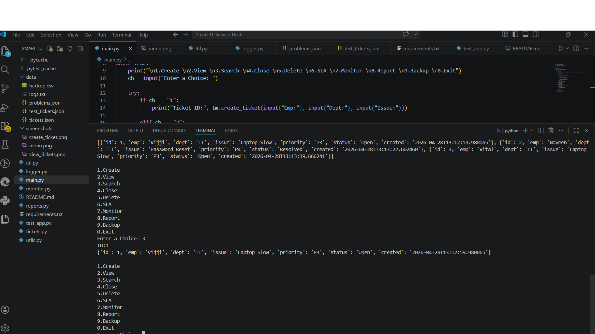
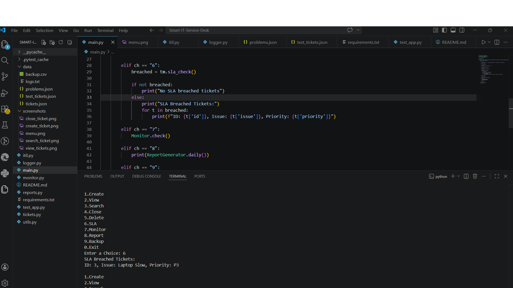
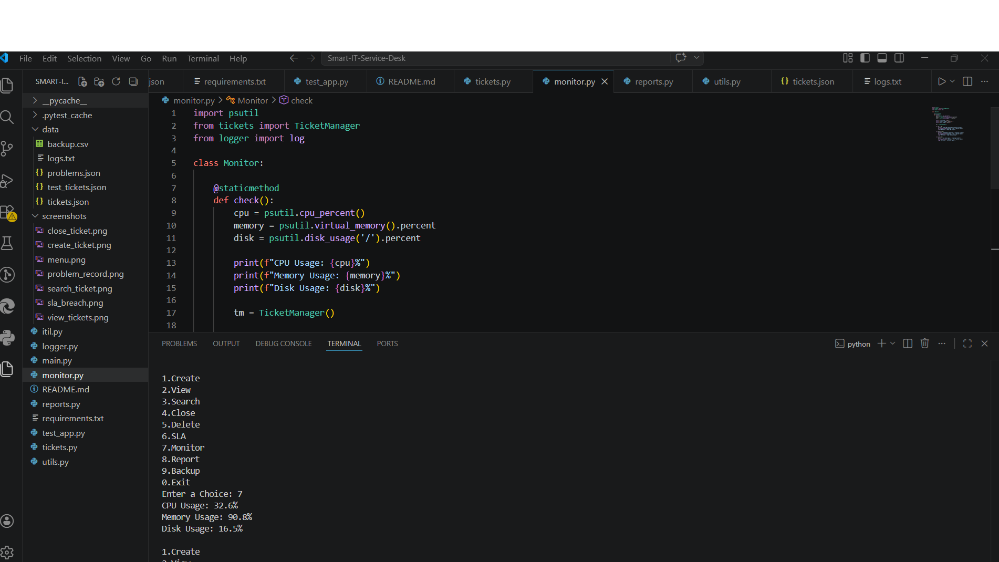
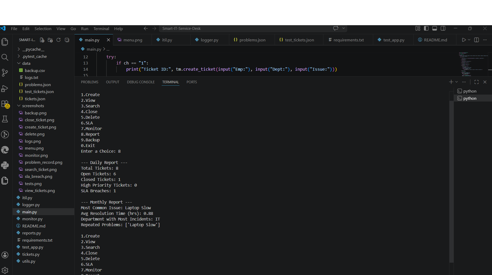
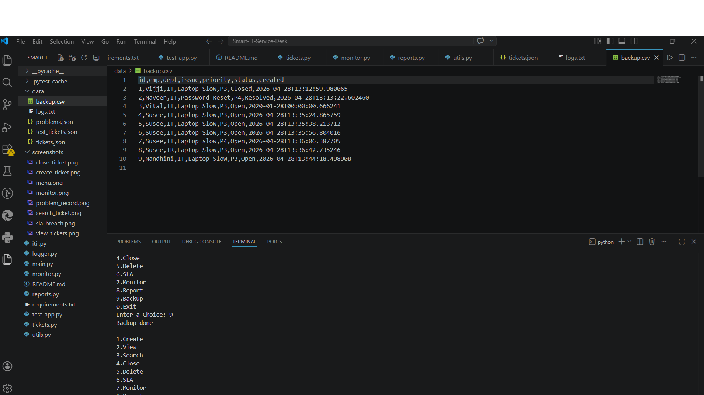
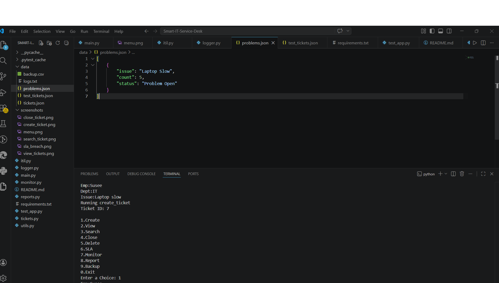
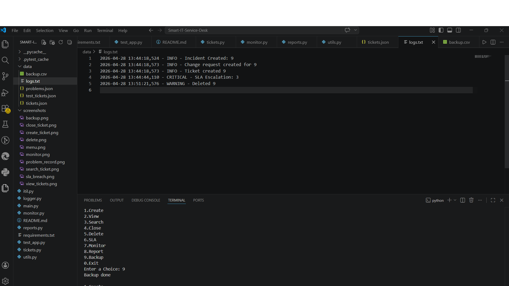
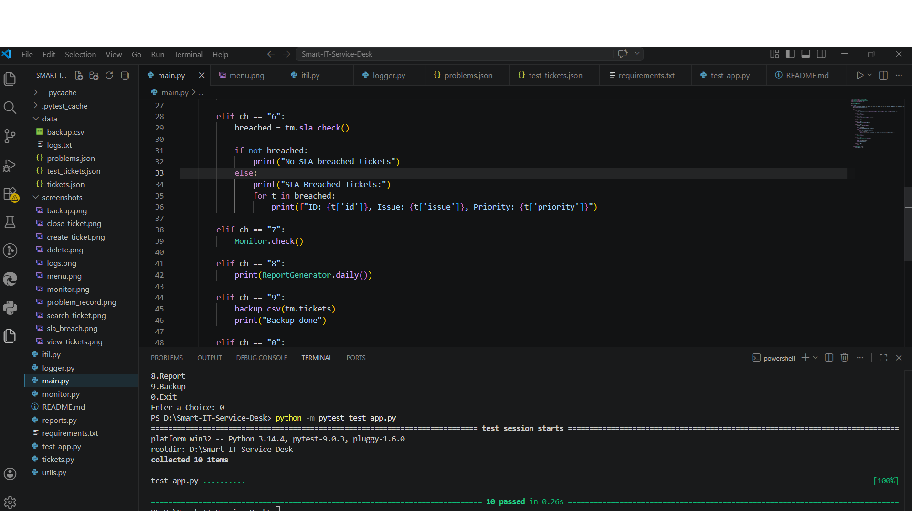

---

## 🪵 Logs Example

```
INFO - Ticket created
WARNING - SLA breached
CRITICAL - CPU usage high
INFO - Change request created
```

---

## 📊 Sample Output

```
{'Total': 2, 'Open': 1, 'Closed': 1, 'High Priority': 1}
```

---

## 🚀 Key Highlights

* Fully automated ITIL workflow
* Real-time monitoring and alert generation
* Structured logging system
* Modular and scalable architecture
* High test coverage using pytest

---

## 📌 Future Enhancements

* Web UI using Flask
* Database integration (SQLite/MySQL)
* Email/SMS notifications
* Dashboard visualization

---

## 👨‍💻 Author

Developed as part of the **Automated ITIL Project**
